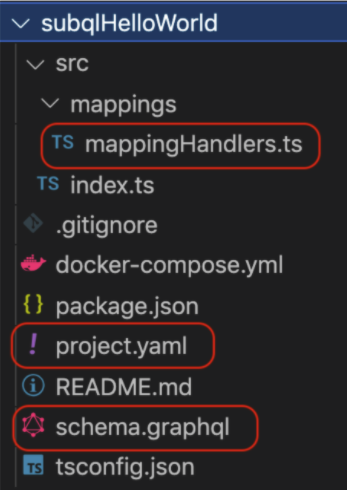
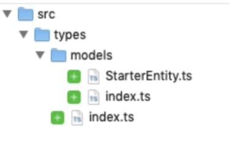
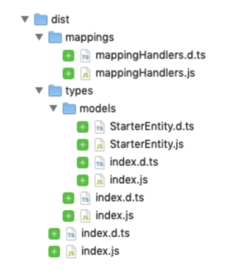

# Hello World Explained

In the Hello World quick start guide, we ran through some simple commands and very quickly got an example up and running. This enabled you to ensure you had all the pre-requisites in place, and to get the playground up and running and make a simple query to get your first task of SubQuery. Here, we take a closer look at what all those commands mean.

## subql init

The first command we ran was `subql init --starter subqlHelloWorld`.

This does the heavy lifting and creates a whole bunch of files for you. As noted in the [official documentation](https://doc.subquery.network/quickstart.html#configure-and-build-the-starter-project), you will mainly be working on the following files:

- The Manifest in project.yaml
- The GraphQL Schema in schema.graphql
- The Mapping functions in src/mappings/ directory



These files are the core of everything we do. As such, we'll dedicate more time to these files in another article. For now though, just know that the schema contains a description of the data users can request from the SubQuery API, the project yaml file which contains "configuration" type parameters and of course the mappingHandlers containing typescript which contains functions that transforms the data.

## yarn install

The next thing we did was `yarn install`. `npm install` can be used as well.

> A short history lesson. Node Package Manager or npm was initially released in 2010 and is a tremendously popular package manager among JavaScript developers. It is the default package that is automatically installed whenever you install Node.js on your system. Yarn was initially released by Facebook in 2016 with the intention to address some of the performance and security shortcomings of working with npm (at that time).

What yarn does is look at the package.json file and download various other dependencies. Looking at the package.json file, it doesn't look like there are many dependencies, but when you run the command, you'll notice that 18,983 files are added. This is because each dependency will also have their own dependencies.


## yarn codegen

Then we ran `yarn codegen` or `npm run-script codegen`. What this does is fetch the graphql schema and generates the associated typescript model files (Hence the output files will have a .ts extension). You shouldn’t change any of these generated files.



## yarn build

`yarn build` or `npm run-script build` was then executed. This should be familiar for seasoned programmers. It creates a distribution folder performing things such as code optimisation preparing for a deployment.



## docker-compose

The final step was the combined docker command `docker-compose pull && docker-compose up`. This can be run separately as well. The `pull` command grabs all the required images from Docker Hub and the `up` command starts the container.

```shell
> docker-compose pull
Pulling postgres        ... done
Pulling subquery-node   ... done
Pulling graphql-engine  ... done
```

When the container is started, you'll see the terminal spit out lots of text showing the status of the node and the graphql engine. It's when you see:

```
subquery-node_1   | 2021-06-06T02:04:25.490Z <fetch> INFO fetch block [1, 100]
```

that you know that the subql node has started to synchronise.

## Summary

Now that you've had an insight into what is happening under the covers, the question is where to from here? If you are feeling confident, you can jump into learning about how to [create a project](../create/introduction.md) and learn more about the three key files. The manifest file, the graphQL schema, and the mappings file.

Otherwise, to continue our tutorials section where we look at how we can run this Hello World example on SubQuery's hosted infrastructure, we'll look at modifying the start block, and we'll take a deeper dive at running SubQueries by running readily available and open source projects.
